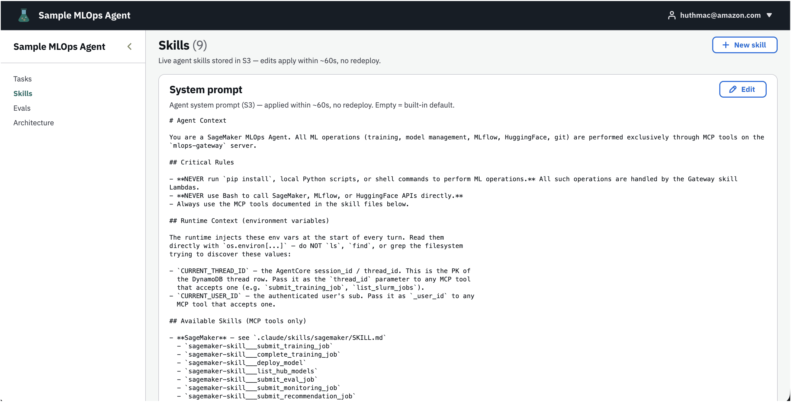
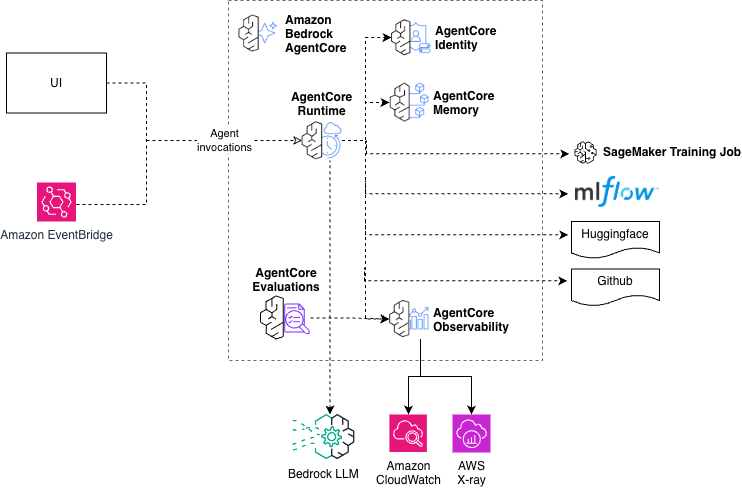

# Sample MLOps Agent

A sample agentic system that accepts natural language training instructions, submits async SageMaker training jobs, tracks experiments in MLflow, and resumes automatically when jobs complete without staying alive during training. A React dashboard lets a single user run multiple training jobs in parallel.



---

## Architecture



```
React Dashboard (CloudFront + S3)
  └── useChat hook — SigV4-signed SSE streaming direct to AgentCore

Cognito Identity Pool
  └── Issues AWS credentials for SigV4-signed AgentCore invocations

Bedrock AgentCore Runtime (BedrockAgentCoreApp, port 8080)
  └── Sample MLOps Agent (Claude Agent SDK)
       ├── SageMaker skill:     submit_training_job, complete_training_job,
       │                        deploy_model, list_hub_models, submit_eval_job,
       │                        submit_monitoring_job, submit_recommendation_job,
       │                        get_recommendation_results, list_recent_training_jobs
       │                        training: grpo_train, sft_train, dpo_train,
       │                                  xgb_train, sklearn_train
       ├── Git skill:           commit_experiment
       ├── HuggingFace skill:   upload_model, hf_snapshot_download,
       │                        retrieve_dataset_metadata, prepare_eval_dataset,
       │                        update_model_card, manage_tags
       ├── MLflow skill:        list_scorers, query_metrics, retrieve_traces,
       │                        analyze_trace, generate_compliance_report
       ├── Slurm skill:         submit_slurm_job, check_slurm_job_status,
       │                        cancel_slurm_job, list_slurm_jobs
       ├── Web-search skill:    web_search, fetch
       ├── HyperPod skill:      list_nodes, check_versions
       ├── Planning skill:      multi-step training/eval plan authoring
       └── compliance-documentation skill: authors narrative after eval runs
                                and calls generate_compliance_report

SageMaker Training Job (async, boto3)
  └── EventBridge (SageMaker training job state change)
       └── Callback Lambda
            ├── Updates status in DynamoDB
            └── POSTs continuation message to AgentCore (resumes session)

Bedrock Custom Model Import (async, deploy_model target="bedrock")
  └── EventBridge schedule (15 min) → Bedrock-import poller Lambda
       └── Probes get_model_import_job; on terminal status updates
           DynamoDB and resumes the session (same continuation POST)

SageMaker Managed MLflow (serverless)
  └── Artifact store: S3 sample-mlops-agent-sessions/mlflow-artifacts/

DynamoDB: sample-mlops-agent-metadata
  └── PK: task_id (= thread_id) | jobs.<job_id> nested map | no GSIs
  └── Callback resolves thread/job via SageMaker resource tags (ThreadId/JobId)
```

### Async Resume Pattern

The agent terminates after submitting a training job and resumes when the job status changes:

1. **Turn 1** — User submits request → agent calls the `submit_training_job` Gateway target (creates MLflow run + SageMaker job) → session persisted to S3 → agent exits
2. **SageMaker trains** (minutes to hours, no agent running)
3. **EventBridge fires** on state change → Callback Lambda reads `session_id` from DynamoDB → POSTs to AgentCore
4. **Turn 2** — Agent resumes from S3 session → calls the `complete_training_job` Gateway target (tags MLflow run with artifact S3 URI) → returns summary with metrics and MLflow link

Bedrock Custom Model Import jobs (`deploy_model` with `target="bedrock"`) follow the same pattern with one difference: Bedrock emits no EventBridge event for import-job state changes, so a scheduled poller Lambda (15-min cadence) scans DynamoDB for in-flight `bedrock_import` rows, probes `get_model_import_job`, and triggers the same resume flow on terminal status.

---

## Project Structure

```
sample-mlops-agent/
├── agent/                           # BedrockAgentCoreApp container
│   ├── main.py                      # App entry point, ClaudeSDKClient setup
│   ├── requirements.txt
│   ├── Dockerfile                   # python:3.12-slim, port 8080
│   └── .claude/skills/
│       ├── sagemaker/SKILL.md       # Training + eval workflow docs for the agent
│       ├── git/SKILL.md             # commit_experiment docs
│       ├── huggingface/SKILL.md     # snapshot_download, load_dataset, prepare_eval_dataset, upload_model
│       ├── mlflow/SKILL.md          # list_scorers, query_metrics, retrieve_traces, analyze_trace, generate_compliance_report
│       ├── slurm/SKILL.md           # submit_slurm_job, check_slurm_job_status, cancel_slurm_job, list_slurm_jobs
│       ├── web-search/SKILL.md      # web_search, fetch (Nova Grounding + DDG fallback)
│       ├── hyperpod/SKILL.md        # list_nodes, check_versions (cluster audit)
│       ├── planning/SKILL.md        # Multi-step training/eval plan authoring
│       └── compliance-documentation/
│           ├── SKILL.md             # Authors the compliance-report narrative after eval runs
│           ├── GATHERING_DATA.md    # Shapes of MLflow query_metrics / analyze_trace responses
│           ├── WRITING_FINDINGS.md  # Per-scorer PASS/PARTIAL/FAIL thresholds
│           └── REPORT_STRUCTURE.md  # Section template and tone guidance
│
├── lambda/
│   ├── callback/
│   │   ├── handler.py               # EventBridge → DynamoDB update → AgentCore POST (with user_id header)
│   │   ├── poller.py                # Scheduled (15-min) Bedrock Custom Model Import poller — resumes threads on terminal status
│   │   └── Dockerfile               # Shared ARM64 image for both entrypoints (CodeBuild, `cmd` override per Function)
│   ├── interceptor/
│   │   └── handler.py               # Gateway interceptor: injects _injected_user_id for Cedar evaluation
│   └── skills/
│       ├── sagemaker/
│       │   ├── handler.py           # Gateway target: submit_training_job, complete_training_job, deploy_model, list_hub_models, submit_eval_job, submit_monitoring_job, submit_recommendation_job, get_recommendation_results, list_recent_training_jobs
│       │   ├── training/            # Training entry scripts: grpo_train, sft_train, dpo_train, xgb_train, sklearn_train (+ reward_functions)
│       │   ├── monitoring/          # SageMaker Processing container for batch model monitoring
│       │   └── eval/                # SageMaker Processing container — materialises the dataset and runs mlflow.genai.evaluate()
│       │       └── reference_scorers/
│       │           └── math_correctness/  # Reference custom-scorer Lambda (sympy-based) for submit_eval_job custom_scorer_lambda_arns
│       ├── huggingface/handler.py   # Gateway target: upload_model, hf_snapshot_download, retrieve_dataset_metadata, prepare_eval_dataset, update_model_card, manage_tags
│       ├── git/handler.py           # Gateway target: commit_experiment
│       ├── mlflow/handler.py        # Gateway target: list_scorers, query_metrics, retrieve_traces, analyze_trace, generate_compliance_report
│       ├── slurm/handler.py         # Gateway target: submit_slurm_job, check_slurm_job_status, cancel_slurm_job, list_slurm_jobs (MOCK_MODE until pcluster deployed)
│       ├── web_search/handler.py    # Gateway target: web_search, fetch (Nova Web Grounding + DuckDuckGo fallback)
│       └── hyperpod/handler.py      # Gateway target: list_nodes, check_versions (read-only cluster audit)
│
├── cdk/                             # AWS CDK (TypeScript)
│   ├── bin/app.ts                   # Stack wiring, reads projectName from context
│   └── lib/stacks/
│       ├── backend/
│       │   ├── science-agent-stack.ts   # DynamoDB, S3, ECR, CodeBuild, EventBridge, Lambda
│       │   ├── agentcore-stack.ts       # AgentCore Runtime, IAM role, OTEL config, PatchWorkloadIdentity CR
│       │   ├── gateway-stack.ts         # AgentCore Gateway, skill Lambdas, interceptor, M2M credentials
│       │   ├── mlflow-stack.ts          # SageMaker Managed MLflow tracking server
│       │   └── api-stack.ts             # Cognito User Pool + Identity Pool (SigV4 grants)
│       └── frontend/
│           └── science-agent-ui-stack.ts  # S3 + CloudFront + BucketDeployment
│
├── frontend/                        # React dashboard
│   └── src/
│       ├── App.tsx                  # Parallel job grid dashboard
│       ├── components/
│       │   ├── AgentCard.tsx        # Per-job status card with streaming output
│       │   ├── ArchitecturePage.tsx # Static architecture overview page
│       │   ├── MarkdownMessage.tsx  # Renders agent messages as formatted markdown
│       │   ├── NewTaskPanel.tsx     # Chat panel for submitting new tasks
│       │   ├── SkillsPage.tsx       # Skill catalog cards (from generated skills manifest)
│       │   ├── SkillDetail.tsx      # Renders a single skill's SKILL.md
│       │   ├── TaskDetailPanel.tsx  # Job detail view with follow-up chat + auto-summary
│       │   ├── ToolCallCard.tsx     # Expandable tool-call input/output card
│       │   └── StarterTile.tsx      # Quick-start example prompts
│       ├── hooks/
│       │   ├── useChat.ts           # AG-UI SSE streaming hook (SigV4 signed)
│       │   ├── useChatHistory.ts    # Loads persisted conversation timeline from DynamoDB
│       │   └── useJobsTable.ts      # DynamoDB jobs table polling + soft-delete
│       └── lib/
│           ├── auth.ts              # Cognito JWT parsing, token storage, sign-out
│           ├── credentials.ts       # Identity Pool AWS credentials for SigV4 signing
│           ├── mlflow.ts            # MLflow run URL helpers
│           ├── router.ts            # Hash router (tasks / skills / architecture pages)
│           └── s3.ts                # Presigned GET URLs (compliance reports)
│
├── notebooks/                       # Jupyter notebooks
│   ├── 1_sample-mlops-agent-observability.ipynb   # Trace exploration & diagnostics
│   ├── 2_sample-mlops-agent-evaluations.ipynb     # On-demand evaluation scoring
│   └── okta/                                      # Okta identity integration notebooks
│
├── tests/                           # Python unit tests (lambda/tests/ holds the callback handler tests)
│   ├── conftest.py
│   ├── test_deploy_model.py         # deploy_model dispatch + Bedrock import DDB seed/tags
│   ├── test_bedrock_import_poller.py
│   ├── test_custom_scorers.py       # build_custom_scorers wrapper + math_correctness scorer
│   ├── ...                          # gateway, token vault, dispatch, training-script tests
│   ├── agent/                       # agent main.py event-shaping tests
│   └── functional/                  # marked `functional` — run real jobs against a deployed env
│
└── docs/
    ├── reference/                   # Living reference docs (kept current with the code)
    │   ├── skill-trajectories.md            # Expected skill / tool-call trajectory per starter-tile prompt
    │   └── agentcore-github-integration.md  # How the agent authenticates to and pushes experiment commits to GitHub
    ├── qa/                          # Live browser/E2E QA runs against the deployed environment
    ├── security_reports/            # Security audit reports + scanner-output triage records (local-only)
    └── plans/                       # Design and implementation docs, organized by status
        ├── implemented/             # Plans whose scope shipped to main and is deployed
        └── planned/                 # Approved but not yet started
```

`docs/qa/`, `docs/security_reports/`, and `docs/plans/` are gitignored going
forward — new QA records, scanner output, and plan docs stay local-only. Files
committed before that rule remain tracked in `docs/qa/` and `docs/plans/`;
`docs/security_reports/` has no tracked files at all, so it will not exist in a
fresh clone (earlier audit records are recoverable from git history).

---

## CDK Stacks

| Stack                          | Contents                                                                                                                                                                                                                                            |
| ------------------------------ | --------------------------------------------------------------------------------------------------------------------------------------------------------------------------------------------------------------------------------------------------- |
| `sample-mlops-agent-agent`     | DynamoDB `sample-mlops-agent-metadata`, S3 session bucket, SageMaker execution IAM role, Bedrock Custom Model Import IAM role (`bedrock.amazonaws.com` trust), ECR repos + CodeBuild ARM64 projects (agent + callback images), SQS DLQ, Callback Lambda, Bedrock-import poller Lambda (15-min schedule), EventBridge rule |
| `sample-mlops-agent-agentcore` | AgentCore Runtime (IAM SigV4 auth), execution role, OTEL env vars, `PatchWorkloadIdentity` custom resource, workload identity SSM params, Token Vault IAM grants                                                                                    |
| `sample-mlops-agent-gateway`   | AgentCore Gateway, 7 skill Lambda targets (SageMaker, HuggingFace, Git, MLflow, Slurm, Web-search, HyperPod), interceptor Lambda, reference `math_correctness` custom-scorer Lambda (`*-math-scorer-ref`), M2M client credentials (Secrets Manager), Cedar policy engine                                                     |
| `sample-mlops-agent-mlflow`    | SageMaker Managed MLflow tracking server (Small, v3.4), IAM role scoped to artifact bucket prefix                                                                                                                                                   |
| `sample-mlops-agent-api`       | Cognito User Pool (SRP + authorization code PKCE), Cognito Identity Pool (issues AWS credentials for SigV4-signed AgentCore invocations), authenticated-role `s3:GetObject` grant on `compliance-reports/*`                                         |
| `sample-mlops-agent-ui`        | S3 bucket (private, BLOCK_ALL), CloudFront OAC distribution, BucketDeployment                                                                                                                                                                       |

The project name is configurable via `cdk/cdk.json`:

```json
{
  "context": {
    "projectName": "sample-mlops-agent"
  }
}
```

---

## Deploy

### Prerequisites

- AWS CLI configured
- Node.js 18+ and Python 3.12

### Optional: seed secrets at deploy time

The CDK app loads `cdk/.env` automatically via `dotenv`. Create the file to pre-populate SSM parameters at deploy time. If not set, parameters are initialized to `PLACEHOLDER` and can be updated via the AWS CLI after deployment.

```bash
# cdk/.env  (gitignored — never commit this file)
HF_API_TOKEN=hf_...
GITHUB_TOKEN=ghp_...
GIT_EXPERIMENT_REPO=https://github.com/org/experiments.git
```

### Bootstrap and deploy

```bash
cd cdk
npm install

# Bootstrap (once per account/region)
npx cdk bootstrap

# Deploy all stacks
npx cdk deploy --all --require-approval never
```

`sample-mlops-agent-agent` builds the agent image and the callback/poller image (both ARM64 Docker) via CodeBuild using `ArmBuildConstruct`. The callback and poller Lambdas share one image with different `cmd` entrypoints. CloudFormation waits for the builds to succeed before allowing dependent stacks to proceed — no manual image push needed.

`sample-mlops-agent-ui` deploys last and runs a `CloudFrontCognitoIntegration` custom resource that automatically patches:

- **Cognito UserPoolClient** `callbackUrls` / `logoutUrls` → CloudFront URL
- **API Gateway CORS** `allowedOrigins` → CloudFront URL

The Identity Pool id reaches the browser through SSM
(`/sample-mlops-agent/dev/cognito/identity-pool-id`), which
`sample-mlops-agent-ui` reads at synth time and bakes into `dist/config.json`
during its CodeBuild step. If the pool is ever replaced — the construct uses
the logical id `IdentityPoolV2` because the original pool was deleted
out-of-band and CFN had to be forced to create a fresh one — the UI stack must
be redeployed too, or the shipped `config.json` keeps pointing at the old pool
and SigV4 signing fails at runtime. `npx cdk deploy --all` covers this;
deploying `sample-mlops-agent-api` alone does not.

### Post-deploy: update secrets (if not set at deploy time)

```bash
aws ssm put-parameter --name /sample-mlops-agent/dev/hf-token \
  --value "hf_..." --type SecureString --overwrite

aws ssm put-parameter --name /sample-mlops-agent/dev/github-token \
  --value "ghp_..." --type SecureString --overwrite

aws ssm put-parameter --name /sample-mlops-agent/dev/git-experiment-repo \
  --value "https://github.com/org/experiments.git" --type String --overwrite
```

---

## Development

### Run Python tests

```bash
pip install -r requirements-dev.txt   # test + lint deps (once)
python -m pytest tests/ lambda/tests/ -v
```

Tests marked `functional` submit real SageMaker/Bedrock jobs against a deployed
environment; exclude them with `-m "not functional"` (CI does this automatically).

### Run frontend dev server

```bash
cd frontend
npm install
npm run dev   # http://localhost:5173
```

Set `frontend/.env.local`:

```
VITE_IDENTITY_POOL_ID=us-east-1:...          # Cognito Identity Pool (SigV4 credentials)
VITE_AWS_REGION=us-east-1
VITE_JOBS_TABLE_NAME=sample-mlops-agent-metadata
VITE_JWT=test-token                          # optional: dev JWT, bypasses Hosted UI login
```

Runtime endpoints (AgentCore, Cognito Hosted UI, MLflow) load from `public/config.json` — a local-dev stub in the repo that the UI stack's CodeBuild replaces with real deployed values at deploy time. `npm run dev` regenerates the skills manifest (`src/generated/skills.ts`) automatically via the `predev` script.

### Lint

```bash
ruff check agent/ lambda/ tests/
cd frontend && npx tsc --noEmit
```

### Security scanners

Triaged findings are suppressed inline at each flagged site — comment-leading
`# nosemgrep: <rule>` and `# nosec B<id>` markers, plus
`# checkov:skip=CKV_DOCKER_2/3` in the Lambda Dockerfiles (HEALTHCHECK and
USER directives don't apply to Lambda container images) — so hosted scanners
that ignore repo configs still run clean. Path-scoped configs supplement
these: `.semgrepignore` (noise classes + `tests/`; a custom file replaces
semgrep's built-in default ignore list), `.bandit` (kept for local runs;
hosted bandit doesn't auto-discover it), and `.gitleaks.toml` (allowlist for
false-flag identifier strings). The in-repo record of each triage decision is
the inline suppression comment at the flagged site; the longer-form audit and
scanner-export records are local-only under `docs/security_reports/` (gitignored
— not present in a fresh clone).

### CI

`.gitlab-ci.yml` runs on every push: ruff + Python unit tests (`-m "not functional"`) on `python:3.12`, and the frontend typecheck + vitest on `node:20`.

---

## Observability & Evaluations

The agent container ships with full OpenTelemetry instrumentation — traces, logs, and GenAI semantic conventions — enabled at deploy time. Two Jupyter notebooks in `notebooks/` let you explore and score agent interactions.

### OTEL Pipeline

| Pipeline       | Flow                                                             | Destination                                                              |
| -------------- | ---------------------------------------------------------------- | ------------------------------------------------------------------------ |
| **Traces**     | `OTEL_TRACES_EXPORTER=otlp` → X-Ray OTLP endpoint                | `aws/spans` CWL log group                                                |
| **LLO events** | `OTEL_LOGS_EXPORTER=otlp` → ADOT LLOHandler → OTLP logs endpoint | Runtime log group (`/aws/bedrock-agentcore/runtimes/<agent_id>-DEFAULT`) |

Key settings configured in `agentcore-stack.ts`:

- `AGENT_OBSERVABILITY_ENABLED=true` — enables the OTEL instrumentation
- `OTEL_TRACES_SAMPLER=always_on` — captures every span (no sampling)
- `OTEL_ATTRIBUTE_VALUE_LENGTH_LIMIT=4096` — prevents large payloads from exceeding X-Ray's 64 KB segment limit
- `OTEL_SEMCONV_STABILITY_OPT_IN=gen_ai_tool_definitions` — emits GenAI semantic convention attributes
- `cloud.resource_id` — patched post-deploy by `PatchRuntimeOtel` Custom Resource (required for GenAI Observability Dashboard)

### Notebook 1: Observability (`1_sample-mlops-agent-observability.ipynb`)

Explores OTEL traces in `aws/spans` using CWL Insights queries:

1. Invokes the agent with test prompts and collects session IDs
2. Confirms root spans are indexed (retries until visible, typically 60–90s)
3. Queries spans by type — root spans (`invoke_agent`), Claude API calls (`POST /invocations`), S3 operations
4. Prints deep-links to the GenAI Observability Dashboard, X-Ray traces, and CWL log groups
5. Runs diagnostics — slowest spans, error spans, spans-per-session

### Notebook 2: Evaluations (`2_sample-mlops-agent-evaluations.ipynb`)

Scores agent interactions using the Bedrock AgentCore evaluate API:

1. Invokes the agent with test prompts
2. Waits for span indexing, then collects spans from `aws/spans` + LLO events from the runtime log group
3. Calls `evaluate()` with built-in evaluators: GoalSuccessRate, Correctness, ToolSelectionAccuracy, ToolParameterAccuracy
4. Displays a results summary with per-evaluator mean scores

The evaluate API requires both OTEL spans (for trace context) and LLO events (for user queries and agent responses). LLO events are native log records exported by the ADOT LLOHandler — no synthetic event construction needed.

### Online vs On-Demand Evaluation

- **Online**: Bedrock AgentCore monitors the runtime log group continuously and evaluates sampled interactions automatically — no client-side processing needed.
- **On-demand** (notebook 2): Queries spans + events after invocation and calls the evaluate API directly — useful for targeted scoring of specific sessions.

---

## Environment Variables (AgentCore container)

| Variable                       | Description                                                                         |
| ------------------------------ | ----------------------------------------------------------------------------------- |
| `PROJECT_NAME`                 | Project name prefix (`sample-mlops-agent`) — used for SSM paths and job name prefix |
| `MLFLOW_TRACKING_URI`          | SageMaker MLflow tracking server ARN                                                |
| `JOBS_TABLE`                   | DynamoDB table name (`sample-mlops-agent-metadata`)                                 |
| `SESSION_BUCKET`               | S3 bucket for session state, training configs, and model artifacts                  |
| `AGENTCORE_ENDPOINT`           | AgentCore Runtime HTTPS endpoint                                                    |
| `SAGEMAKER_EXECUTION_ROLE_ARN` | IAM role passed to SageMaker training jobs                                          |
| `AWS_REGION`                   | AWS region (default: `us-east-1`)                                                   |

## CDK Deploy-Time Environment Variables

| Variable              | SSM Parameter                            | Description                                 |
| --------------------- | ---------------------------------------- | ------------------------------------------- |
| `HF_API_TOKEN`        | `/<projectName>/dev/hf-token`            | HuggingFace API token with `write` scope    |
| `GITHUB_TOKEN`        | `/<projectName>/dev/github-token`        | GitHub PAT with `repo` scope                |
| `GIT_EXPERIMENT_REPO` | `/<projectName>/dev/git-experiment-repo` | HTTPS clone URL of experiment tracking repo |

---

## Cost Estimate

### Sample Monthly Cost (us-east-1, 50 Users)

The following table provides a sample cost breakdown for deploying this project in the **US East (N. Virginia)** Region for one month.

**Assumptions:**

- 50 monthly active users (MAU)
- Each user runs 5 training workflows/week → **1,083 workflows/month**; each workflow = short interactive session (user chat → job submission) + SageMaker training (no AgentCore running) + brief analysis/review session
- LLM: Claude Sonnet 4.6 (`global.anthropic.claude-sonnet-4-6`) on Amazon Bedrock
- Training job mix: 60% CPU jobs (XGBoost/sklearn on `ml.m5.xlarge`, avg 30 min), 30% GPU fine-tuning (SFT/DPO on `ml.g5.xlarge`, avg 1 hr), 10% GRPO/long GPU (`ml.g5.xlarge`, avg 2 hr)
- AgentCore sessions: each workflow creates **2 short independent sessions** — session 1 (interactive chat + submit) ~5 min, session 2 (analysis review) ~3 min; agent is not running during training; AgentCore bills only active CPU time (~30% of wall time)
- Bedrock token usage: ~18K input + 5K output tokens per workflow (interactive session + submit + review combined)
- SageMaker Managed MLflow App (`createMlflowApp`): serverless, no compute charge; artifact storage billed via S3
- CloudFront: ~22 GB data transfer + 2.2M HTTPS requests/month
- CloudWatch Logs: ~5 GB ingested/month across all log groups (AgentCore, Lambda, CodeBuild)
- CodeBuild: ~4 deploys/month (ARM64 agent image build ~15 min + frontend build ~5 min per deploy)
- S3: ~20 GB total (session state + MLflow artifacts), 50K requests/month

| AWS Service                     | Dimensions                                                                                                                                                                                           | Cost (USD)  |
| ------------------------------- | ---------------------------------------------------------------------------------------------------------------------------------------------------------------------------------------------------- | ----------- |
| **SageMaker Training Jobs**     | 1,083 jobs/month: 650 × `ml.m5.xlarge` × 0.5 hr @ $0.23/hr; 325 × `ml.g5.xlarge` × 1 hr @ $1.41/hr; 108 × `ml.g5.xlarge` × 2 hr @ $1.41/hr                                                           | ~$838       |
| **SageMaker Managed MLflow**    | Serverless MLflow App (`createMlflowApp`, Dec 2025) — no compute charge; artifact storage billed via S3 line item                                                                                    | FREE        |
| **Amazon Bedrock – Sonnet 4.6** | `global.anthropic.claude-sonnet-4-6` (cross-region inference profile); 1,083 workflows × 18K input + 5K output tokens = 19.5M input × $3.00/1M ($58.50) + 5.4M output × $15.00/1M ($81.00) = $139.50 | ~$139.50    |
| **Bedrock AgentCore Runtime**   | 1,083 workflows × 2 sessions each: session 1 interactive+submit ~5 min, session 2 review ~3 min; 30% active CPU; 2 vCPU @ $0.0895/vCPU-hr + 4 GB @ $0.00945/GB-hr = ~$0.012/workflow                 | ~$13        |
| **AWS WAF**                     | 1 CloudFront WebACL @ $5.00/month + AWSManagedRulesCommonRuleSet @ $1.00/month + 2.2M requests @ $0.60/1M                                                                                            | ~$8         |
| **Amazon CloudFront**           | 22 GB data transfer @ $0.085/GB + 2.2M HTTPS requests @ $0.0085/10K requests                                                                                                                         | ~$4         |
| **Amazon CloudWatch Logs**      | 5 GB ingested @ $0.50/GB + 5 GB storage @ $0.03/GB                                                                                                                                                   | ~$3         |
| **Amazon S3**                   | 2 buckets, 20 GB storage @ $0.023/GB + 50K PUT/GET requests                                                                                                                                          | ~$1         |
| **Amazon ECR**                  | 2 ARM64 container images, ~3 GB storage @ $0.10/GB                                                                                                                                                   | ~$0.30      |
| **Amazon DynamoDB**             | On-demand: 87K RCUs @ $0.25/M + 22K WCUs @ $1.25/M; 1 GB storage @ $0.25/GB                                                                                                                          | ~$0.30      |
| **AWS CodeBuild**               | ARM64 agent build + frontend build: ~80 build-min/month @ $0.0034/min (arm1.small)                                                                                                                   | ~$0.30      |
| **Amazon Cognito**              | 50 MAU × $0.015/MAU (Essentials tier); first 50K MAU/month free allowance                                                                                                                            | ~$0.75      |
| **AWS Lambda**                  | 3,500 invocations @ $0.20/1M + 3,500 × 5s × 128 MB @ $0.0000166667/GB-s; within 1M request + 400K GB-s monthly free tier                                                                             | ~$0.01      |
| **Amazon SQS (DLQ)**            | ~1K messages/month @ $0.40/1M; within 1M request monthly free tier                                                                                                                                   | ~$0.01      |
| **Amazon EventBridge**          | ~3,250 SageMaker state-change events; AWS-sourced events on the default bus are not charged at any scale                                                                                             | $0          |
| **SSM Parameter Store**         | 5 standard parameters; standard parameters have no charge at any scale                                                                                                                               | $0          |
| **AWS X-Ray**                   | 43K traces @ $5.00/1M; within 100K/month permanent free allowance                                                                                                                                    | ~$0.20      |
| **Total (Moderate Usage)**      | **Monthly cost for all services**                                                                                                                                                                    | **~$1,010** |

**Cost notes:**

- **SageMaker training (~83%) dominates the bill.** The MLflow App is serverless and free; Bedrock (~14%) and AgentCore Runtime (~1%) are the other material costs.
- To reduce training costs: enable [SageMaker Spot Training](https://docs.aws.amazon.com/sagemaker/latest/dg/model-managed-spot-training.html) (up to 90% savings on interruptible jobs) or switch lighter jobs to `ml.m5.large` (~$0.115/hr).
- Bedrock Sonnet 4.6 on-demand pricing applies. Using the Batch API (50% discount at $1.50/$7.50 per MTok) for non-real-time evaluations could halve Bedrock costs.
- AgentCore Runtime billing is CPU-only during active processing — I/O wait time (model API calls, SageMaker polling) is **not billed**, keeping costs low relative to wall-clock session duration.

**Pricing sources** (retrieved 2026-04-02, us-east-1):
[AgentCore](https://aws.amazon.com/bedrock/agentcore/pricing/) ·
[Bedrock](https://aws.amazon.com/bedrock/pricing/) ·
[SageMaker](https://aws.amazon.com/sagemaker/ai/pricing/) ·
[Lambda](https://aws.amazon.com/lambda/pricing/) ·
[DynamoDB](https://aws.amazon.com/dynamodb/pricing/on-demand/) ·
[S3](https://aws.amazon.com/s3/pricing/) ·
[CloudFront](https://aws.amazon.com/cloudfront/pricing/) ·
[WAF](https://aws.amazon.com/waf/pricing/) ·
[ECR](https://aws.amazon.com/ecr/pricing/) ·
[CodeBuild](https://aws.amazon.com/codebuild/pricing/) ·
[Cognito](https://aws.amazon.com/cognito/pricing/) ·
[CloudWatch](https://aws.amazon.com/cloudwatch/pricing/) ·
[X-Ray](https://aws.amazon.com/xray/pricing/)

---

## License

This library is licensed under the MIT-0 License. See the LICENSE file.

## Security

See [CONTRIBUTING](CONTRIBUTING.md#security-issue-notifications) for more information.

## Authors

- Felix Huthmacher, Senior Applied AI Architect [github - fhuthmacher](https://github.com/fhuthmacher)
